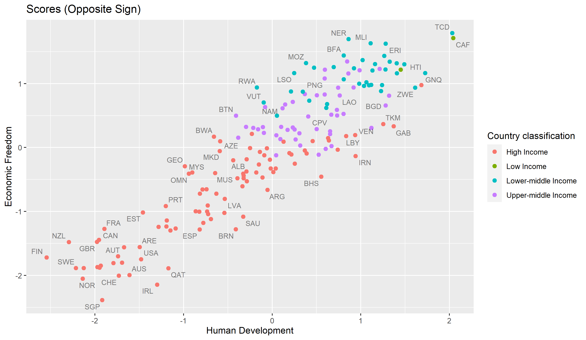

# Investigating the Relationship Between Economic Freedom and Human Development: A Canonical Correlation Analysis

You can read the report here: <https://github.com/quan-possible/econ-freedom/blob/main/Documentation/final.pdf>

In this project, we attempt to find out how the variables that constitute economic freedom correlate with those that determine human development of nations. Specifically, we conducted a canonical correlation analysis on the two sets of variables:

 - Set X representing economic freedom which consists of 12 variables: Property Rights, Government Integrity, Judicial Effectiveness, Government Spending, Tax Burden, Fiscal Health, Business Freedom, Labor Freedom, Monetary Freedom, Trade Freedom, Investment Freedom, Financial Freedom.
 - Set Y representing human development which consists of 4 variables: Life Expectancy at Birth, Expected Years of Schooling, Mean Years of Schooling, GNI per capita (PPP $).

The data for the two sets are obtained from the [Index of Economic Freedom](https://www.heritage.org/index/) and the [Human Development Index](http://hdr.undp.org/en/content/human-development-index-hdi), respectively.
